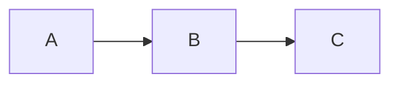

# ankiBW
A modern Anki theme/setup inspired by my current terminal theme, [boogiewoogie](https://github.com/capaldo/boogiewoogie). The color scheme is partially inspired by Piet Mondrian's paintings *Victory Boogie Woogie* and *Broadway Boogie Woogie*. I'm mainly including this as a reference for others if they're looking to customize their setups as much as I have but you're free to copy it verbatim. Some things are specific to myself (such as my card kind names) so please be aware of this and alter the files accordingly.

## Prerequisites
Some plugins are required in order to achieve an appearance akin to what I have shown in the screenshots. These include: 
* [Hierarchal Tags](https://github.com/pneff/anki-hierarchical-tags)
* a font patched with nerd-font

### Internal Files
In addition to the above, additional styling has been added via the internal files for Anki. This has only been tested on **macOS** but I suspect
it should work just fine on the various Linux distributions. I'm unsure how it would work on windows.

## Features

### Tooltips
Each card has a "simple-popup" field allowing for the addition of a tooltip when text is added to the field. This is a great way to include acronyms or extra information without crowding the card with too much text.

### Mermaid Graphs
Getting quick graphs into Anki can be difficult when you want to make your own. That's why each of the cards templates include the [mermaid.js](https://github.com/knsv/mermaid) API to allow for generation of graphs on-the-fly. For more information on syntax and chart types please refer to the API's [documentation](https://mermaidjs.github.io). Currently, the best way for syntax to be written is the following: 

Keeping it in one line consistently produces the graph on both desktop (macOS) and mobile (iOS). Currently the graph rendering is only available for Basic cards.

### Color Scheme 
| Color        | RGB Code      |
| ------------ | --------      |
| Black        | 0, 0, 0       |
| Gray 0       | 28, 28, 30    |
| Gray 1       | 44, 44, 46    |
| Gray 2       | 58, 58, 60    |
| Gray 3       | 72, 72, 74    |
| Gray 4       | 99, 99, 102   |
| Gray 5       | 162, 162, 167 |
| White        | 255, 255, 255 |
| Blue	       | 10, 132, 255  |
| Brown        | 172, 142, 104 |
| Green        | 50, 215, 75   |
| Indigo       | 94, 92, 230   |
| Orange       | 255, 159, 10  |
| Pink	       | 255, 55, 95   |
| Purple       | 191, 90, 242  |
| Red	       | 255, 69, 58   |
| Teal	       | 100, 210, 255 |
| Yellow       | 255, 214, 10  |

